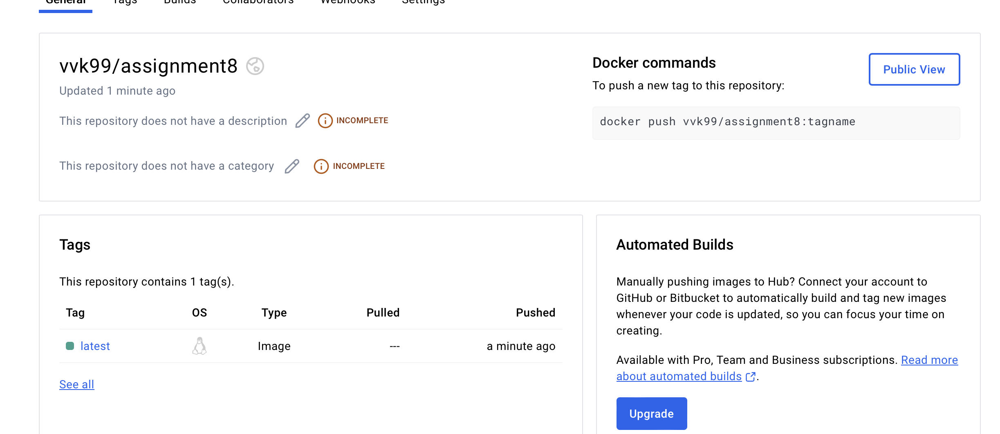
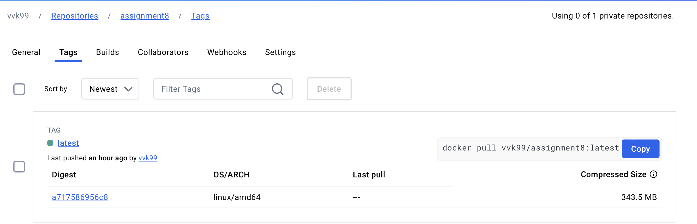

# Assignment 8

## Overview
Ensure that the GitHub Actions workflow runs successfully. It should automatically test, build, and push your Docker image to DockerHub whenever you push to the main branch or create a pull request targeting the main branch.
By the end of this assignment, you will have a fully automated CI/CD pipeline that ensures your Python application is tested, built, and deployed as a Docker image to DockerHub with every code change.

Create a New GitHub Repository:

### 2. Create a New GitHub Repository

Create a new repository on GitHub. Name it appropriately based on your project.
### 3. Clone the Repository Locally:

Clone your new GitHub repository to your local machine using the following command:

```sh
git clone git@github.com:vinaykath/Assignment8.git
```

Navigate into the cloned repository directory.

### 4. Setup Project Structure:

Created a project structure similar to the one in the provided:

- **.github/workflows/**
- **production.yml**
- **.pytest_cache/**
- **app/**
- **__pycache__/**
- **__init__.py**
- **tests/**
- **__pycache__/**
- **__init__.py**
- **conftest.py**
- **start_test.py**
- **venv/**
- **.dockerignore**
- **.gitignore**
- **.readme.md**
- **Docker_repository.png**
- **Dockerfile**
- **main.py**
- **pytest.ini**
- **requirements.txt**

### 5. Create Python Application:

In the app directory, create your Python application code. Ensure you have an __init__.py file to make it a package.

### 6. Write Tests:

In the tests directory, create test cases for your application using pytest. Ensure you have an __init__.py, conftest.py, and other test files like start_test.py.

### 7. Dockerize Your Application:

Write a Dockerfile to containerize your Python application. Ensure it installs necessary dependencies and sets up the application correctly.

### 8. Setup GitHub Actions Workflow:

In the .github/workflows directory, create a production.yml file with the following content to set up the CI/CD pipeline:
yaml
Copy code
name: CI/CD Pipeline

on:
  push:
    branches:
      - main
  pull_request:
    branches:
      - main

jobs:
  test:
    runs-on: ubuntu-latest
    steps:
      - uses: actions/checkout@v4
      
      - name: Set up Python
        uses: actions/setup-python@v5
        with:
          python-version: '3.11.4'
          
      - name: Install dependencies
        run: |
          python -m pip install --upgrade pip
          pip install -r requirements.txt
          
      - name: Run tests with Pytest
        run: pytest

  build-and-push-docker:
    needs: test
    runs-on: ubuntu-latest
    environment: production
    steps:
      - uses: actions/checkout@v4
      
      - name: Set up Docker Buildx
        uses: docker/setup-buildx-action@v3
      
      - name: Log in to DockerHub
        uses: docker/login-action@v3
        with:
          username: ${{ secrets.DOCKERHUB_USERNAME }}
          password: ${{ secrets.DOCKERHUB_TOKEN }}
          
      - name: Build and push Docker image
        uses: docker/build-push-action@v5
        with:
          push: true
          tags: vvk99/assignment8:latest
### 9. Add Secrets to GitHub Repository:

Add DOCKERHUB_USERNAME and DOCKERHUB_TOKEN secrets in the repository settings on GitHub.

### 10. Commit and Push Changes:

Commit all your changes and push them to the main branch of your GitHub repository.
Verify CI/CD Pipeline:

### 11. Image published in Docker hub account

